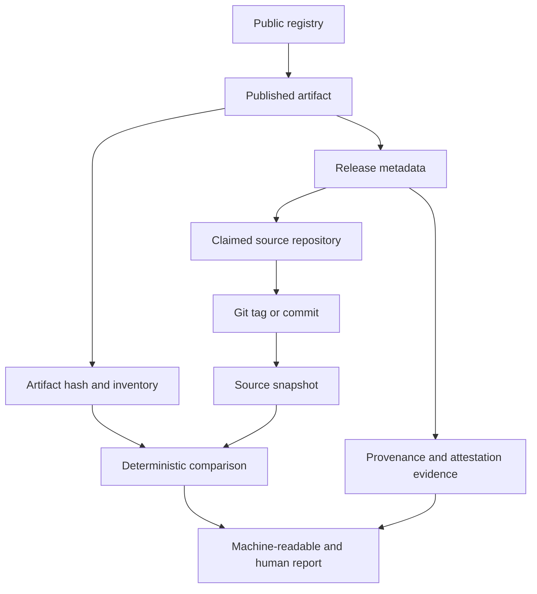

# ReleaseCheck

ReleaseCheck is planned as a deterministic Go CLI and SDK for examining whether a package published to a public registry corresponds to its claimed source repository and release reference.

This repository is in the bootstrap phase. The v0.1 verification engine is intentionally not implemented yet. The project currently contains the scope, research, architecture decisions, security boundaries, roadmap, and contributor guidance that will govern implementation.

## Problem

Package consumers can often download an artifact and discover a repository URL, but the relationship between the bytes received and the claimed source release is not always obvious. ReleaseCheck will collect that relationship as inspectable evidence:

Differences are evidence, not automatic proof of maliciousness. Build systems may legitimately transform source into distributable files. Reports will distinguish facts, inferences, warnings, limitations, and verdicts.

## v0.1 scope

The initial release is limited to npm and PyPI. It will retrieve registry metadata and artifacts, resolve source references where possible, compare archive contents deterministically, record security-relevant archive and metadata observations, consume supported provenance evidence, and emit human-readable, JSON, and SARIF reports with meaningful exit statuses.

It will not install packages, run package code, run lifecycle scripts, run Python build backends, execute arbitrary builds, scan for vulnerabilities, generate SBOMs, or implement Sigstore or SLSA.

## Project status

Phases 0 through 5 are complete: discovery, repository foundation, domain contracts, safe artifact acquisition, and fixture-backed npm and PyPI verification paths. Phase 6, comparison-engine hardening, is next. See [ROADMAP.md](ROADMAP.md), [PROJECT_CONTEXT.md](PROJECT_CONTEXT.md), and [docs/DESIGN.md](docs/DESIGN.md).

## Security boundary

ReleaseCheck processes untrusted package artifacts. It must never execute package code or installation/build hooks merely to inspect a release. Archive extraction and parsing will be bounded and path-safe. See [SECURITY.md](SECURITY.md) and the threat model in [docs/DESIGN.md](docs/DESIGN.md).

## Contributing

Read [CONTRIBUTING.md](CONTRIBUTING.md) before making changes. The repository is intentionally documentation-led: implementation work must satisfy the phase acceptance criteria and update the durable project records.

## License

ReleaseCheck is licensed under the Apache License 2.0. See [LICENSE](LICENSE).
