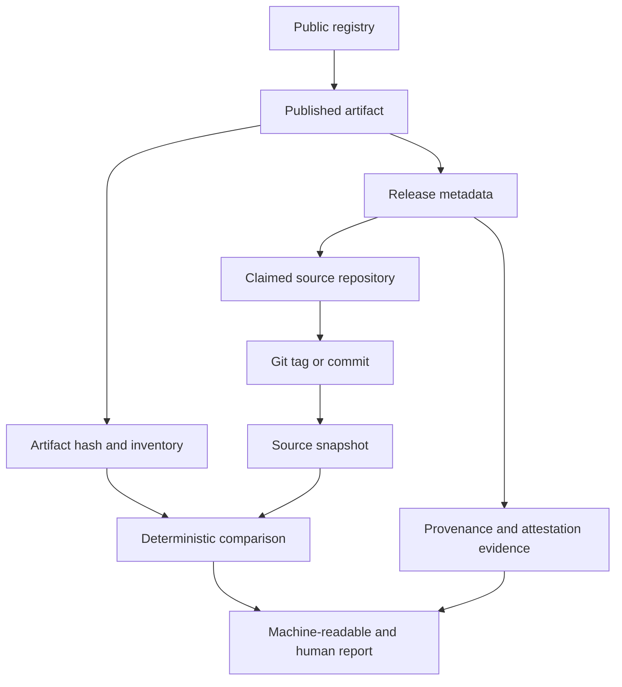

# ReleaseCheck

ReleaseCheck is a deterministic Go CLI for examining whether a package published to a public registry corresponds to its claimed source repository and release reference. A stable public SDK is future work.

The repository is being built phase by phase. The current codebase contains the domain model, safe artifact acquisition, internal npm and PyPI verification paths, deterministic comparison and security observations, provenance evidence parsing, internal report renderers, an offline fixture matrix, the initial CLI, and cross-platform release engineering. A public SDK remains future roadmap work.

## Problem

Package consumers can often download an artifact and discover a repository URL, but the relationship between the bytes received and the claimed source release is not always obvious. ReleaseCheck collects that relationship as inspectable evidence:



Differences are evidence, not automatic proof of maliciousness. Build systems may legitimately transform source into distributable files. Reports will distinguish facts, inferences, warnings, limitations, and verdicts.

## v0.1 scope

The initial release is limited to npm and PyPI. It will retrieve registry metadata and artifacts, resolve source references where possible, compare archive contents deterministically, record security-relevant archive and metadata observations, consume supported provenance evidence, and emit human-readable, JSON, and SARIF reports with meaningful exit statuses.

It will not install packages, run package code, run lifecycle scripts, run Python build backends, execute arbitrary builds, scan for vulnerabilities, generate SBOMs, or implement Sigstore or SLSA.

## Project status

Phases 0 through 13 are complete: discovery, repository foundation, domain contracts, safe artifact acquisition, fixture-backed npm and PyPI verification paths, deterministic comparison hardening, structural security analysis, provenance evidence parsing, stable report rendering, offline fixture coverage, the initial CLI, release engineering, and contributor readiness. Phase 14, the independent final audit, is next. See [ROADMAP.md](ROADMAP.md), [PROJECT_CONTEXT.md](PROJECT_CONTEXT.md), [docs/DESIGN.md](docs/DESIGN.md), and [docs/RELEASE.md](docs/RELEASE.md).

## Installation

There is no package-manager distribution yet. Build from a checked-out release or commit with Go 1.25 or newer:

```text
go build -trimpath -o releasecheck ./cmd/releasecheck
```

The Phase 12 release workflow publishes archives for Linux amd64/arm64, macOS amd64/arm64, and Windows amd64 when a version tag is created. See [docs/RELEASE.md](docs/RELEASE.md).

## Usage

Build the command locally:

```text
go build ./cmd/releasecheck
```

Verify a selected release from npm or PyPI:

```text
releasecheck verify npm [flags] NAME [VERSION]
releasecheck verify pypi [flags] NAME [VERSION]
```

Useful flags are `--json`, `--sarif`, `--output PATH`, `--artifact FILENAME` for PyPI, and `--timeout DURATION`. The command never installs packages, runs lifecycle scripts, executes Python build logic, or invokes package managers. Exit code `0` means `MATCH`; `1` means `REVIEW` or `INCOMPLETE`; `2` means usage error; and `3` means operational or rendering error.

For output contracts and examples, see [docs/REPORTS.md](docs/REPORTS.md) and [docs/USAGE.md](docs/USAGE.md).

## What ReleaseCheck verifies

ReleaseCheck collects registry metadata, the selected artifact, artifact hashes and file inventory, claimed source information, a source snapshot where supported, deterministic file comparisons, structural security observations, and available provenance evidence. It reports the chain as evidence rather than reducing it to an unsupported security guarantee.

`MATCH` means the available comparison evidence is identical and no review signal or limitation prevented that result. `REVIEW` means differences or security/provenance observations require inspection. `INCOMPLETE` means important evidence could not be obtained; it does not silently pass CI.

## What it does not verify

ReleaseCheck does not prove that code is benign, detect all malware, reproduce arbitrary builds, verify every signature or certificate chain, establish maintainer identity, or prove that a source repository is honest. It does not install packages, execute package code, run build backends, scan vulnerabilities, generate SBOMs, or implement Sigstore or SLSA.

Wheels, bundled JavaScript, compiled extensions, generated files, and other transformed distributions may legitimately differ from source. A difference is evidence for review, not an automatic maliciousness verdict.

## CI usage

The CLI is suitable for CI because its exit status is stable and its JSON/SARIF output is machine-readable:

```text
releasecheck verify npm --json --output releasecheck.json package-name
```

Use `--sarif` for systems that ingest SARIF. Keep reports and package inputs treated as untrusted data, and do not pass package metadata into shell commands. See [docs/CI.md](docs/CI.md) for a complete example.

## Current limitations

The v0.1 implementation supports npm and PyPI. Source retrieval is currently limited to supported GitHub source URLs, registry adapters do not yet wire every package manifest into structural analysis, and provenance evidence is parsed but not cryptographically verified. The CLI uses public registry defaults and has no mirror configuration yet. The internal packages are not a compatibility SDK. See [docs/DESIGN.md](docs/DESIGN.md) for the complete limitation record.

## Relationship to existing tools

ReleaseCheck overlaps with registry integrity, provenance, reproducibility, and supply-chain tools. It deliberately does not replace them. Its current focus is a small, explicit evidence chain across npm and PyPI, with safe non-executing inspection and common report semantics. See [docs/COMPETITIVE_LANDSCAPE.md](docs/COMPETITIVE_LANDSCAPE.md) for the researched boundaries and source links.

## Security boundary

ReleaseCheck processes untrusted package artifacts. It must never execute package code or installation/build hooks merely to inspect a release. Archive extraction and parsing is bounded and path-safe. See [SECURITY.md](SECURITY.md) and the threat model in [docs/DESIGN.md](docs/DESIGN.md).

## Contributing

Read [CONTRIBUTING.md](CONTRIBUTING.md) before making changes. The repository is intentionally documentation-led: implementation work must satisfy the phase acceptance criteria and update the durable project records.

## License

ReleaseCheck is licensed under the Apache License 2.0. See [LICENSE](LICENSE).
