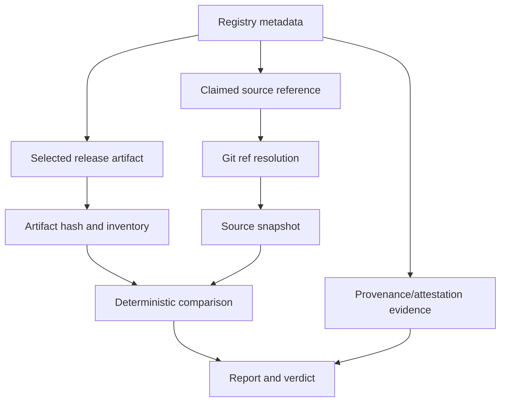

# ReleaseCheck Design

## Problem and goals

A public registry can provide a versioned artifact and metadata pointing toward source, but consumers still need a clear answer to: what bytes were published, what source release was claimed, how do their contents relate, and what evidence is missing? ReleaseCheck collects that answer without installing or executing the package.

Goals: deterministic npm and PyPI metadata/artifact identification; hashes and inventories; source/git resolution with explicit limitations; safe comparison; structural security observations; supported provenance evidence; stable human, JSON, and SARIF reports; meaningful exit codes; offline testing; and small future adapter seams.

## Non-goals

No installation, package execution, arbitrary build, vulnerability scan, SBOM, malware verdict, dashboard, GitHub App, AI authority, Sigstore implementation, SLSA implementation, or future registry support in v0.1.

## Evidence chain

Evidence classifications:

- Known: directly observed or cryptographically calculated, such as a downloaded hash or metadata field.
- Inferred: documented interpretation, such as a normalized repository URL.
- Unavailable: information not retrieved or verified.
- Difference: deterministic relationship between inventories or hashes.
- Observation: structural signal such as an install script or symlink.
- Warning: a concern that does not assert maliciousness.
- Limitation: why a stronger conclusion cannot be made.

## Trust boundaries

Untrusted inputs are registry responses, package bytes, archive paths, repository metadata, refs, source archives, and attestations. Trusted local components are ReleaseCheck code, the Go runtime, configured limits, and hash implementations. External registries, Git hosting, and attestation services provide evidence; they are not unquestioned authorities for source equivalence.

## Registry adapters and source resolution

An adapter translates ecosystem metadata into package identity, selected version/file, URL, digests, source links, claimed refs, and provenance locations. The core pipeline must not know npm/PyPI field quirks. v0.1 contains only those two adapters.

### Phase 2 domain contracts

The initial Go domain package is `internal/domain`. Its contracts are deliberately data-oriented:

- `PackageIdentity`, `ReleaseRequest`, `Artifact`, and `ReleaseMetadata` describe normalized registry results.
- `RegistryAdapter` has only `Registry()` and `Resolve(context.Context, ReleaseRequest)`, keeping transport and ecosystem behavior outside the core model.
- `SourceReference` and `GitReference` preserve claims and resolution strength without treating a URL or tag as proof.
- `FileEntry`, `FileComparison`, and `SortComparisons` represent inventory evidence with stable path ordering.
- `Evidence`, `ProvenanceEvidence`, and `Report` preserve known, inferred, unavailable, invalid, and insufficient states.
- `Verdict` and `ExitCode` are separate so a human/CI policy can evolve without changing evidence semantics.
- `DomainError` and `ErrorKind` classify failures without losing the wrapped cause.
- `Cache` accepts standard cancellation/deadline context and uses opaque keys; implementations must use immutable digests or resolved commits rather than mutable refs.

The model uses JSON tags as the first machine-readable shape, but the schema is not considered stable until Phase 9. Validation is limited to cross-ecosystem invariants; registry-specific grammar remains in adapters. A larger plugin system, callback-heavy pipeline, or generic metadata map was rejected because it would hide semantics and expand the attack surface before two adapters exist.

Resolution is staged: identify repository URL, normalize only defined URL forms, determine a claimed tag/commit from metadata or supported attestations, then retrieve a snapshot. A full commit is stronger than a movable branch/tag. A repository URL or URL verification is not proof that this artifact was built from that source.

## Artifact acquisition and archive handling

Use HTTPS, timeouts, redirect limits/policy, content-length checks, bounded streaming downloads, SHA-256, safe temporary files, and cleanup. Verify registry-provided hashes where available. Validate archive format and reject or report absolute paths, traversal, malformed headers, expansion beyond limits, excessive entries, special entries, and unsafe links. Inventory regular files without following links. Never extract blindly and never pipe downloads to shell commands or package managers.

## Deterministic comparison

Compare validated logical entries using normalized relative paths and SHA-256 hashes. Identify identical, source-only, artifact-only, modified, and type-mismatched files in stable lexical order. Normalization must be narrow and documented; generated files are not silently discarded. Archive hashes remain separate from extracted-file comparison.

Wheels and other built distributions are not presumed byte-for-byte source representations. Reports must state when comparison is structural or partial. A difference is evidence, not automatic proof of maliciousness.

## Provenance and attestations

Consume supported npm and PyPI evidence and record present, absent, unavailable, invalid, or insufficient states. Where verified, record artifact digest, identity, workflow, source URI, or commit. Do not recreate Sigstore, Rekor, Fulcio, SLSA, npm, or PyPI infrastructure. Provenance may establish an identity/build claim while not proving benign code or source/artifact equality.

## Reports, verdicts, exit codes, caching, and errors

Reports keep facts/observations separate from policy. Planned stable verdicts are `MATCH`, `REVIEW`, `INCOMPLETE`, and `ERROR`; exact semantics and versioned JSON schema are frozen during implementation. Exit codes distinguish successful analysis with review findings from operational failure. `MATCH` never means safe and `REVIEW` never means malicious.

Cache keys use immutable URLs/digests and resolved commit IDs where possible. Mutable refs are not immutable cache keys. Cache hits preserve retrieval metadata. Errors are classified as input/metadata, network, integrity, archive safety, source resolution, provenance, comparison, reporting, or internal errors. Partial evidence is allowed only when a stronger verdict is prevented, and output must not leak secrets or terminal control sequences.

## Security boundary and limitations

ReleaseCheck never runs package code, npm lifecycle scripts, `npm install`, Python installation, `setup.py`, arbitrary build backends, post-install hooks, `eval`, or metadata-derived commands. Resource limits protect memory, disk, CPU, and network.

A source URL may be wrong, private, deleted, or ambiguous. Tags can move; archives can be regenerated; build tools transform files; wheels contain generated/native content; provenance can be absent or valid while code remains harmful; and structural analysis cannot detect every malicious behavior.

Important decisions must record what, why, alternatives, rejection reasons, security implications, and future impact in this document, PROJECT_CONTEXT.md, or a focused decision record.
