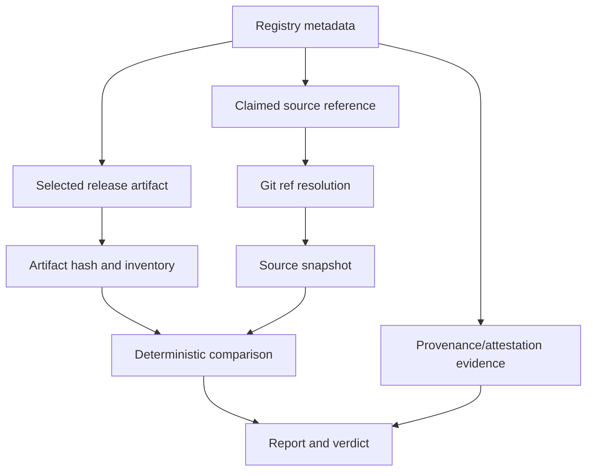

# ReleaseCheck Design

## Problem and goals

A public registry can provide a versioned artifact and metadata pointing toward source, but consumers still need a clear answer to: what bytes were published, what source release was claimed, how do their contents relate, and what evidence is missing? ReleaseCheck collects that answer without installing or executing the package.

Goals: deterministic npm and PyPI metadata/artifact identification; hashes and inventories; source/git resolution with explicit limitations; safe comparison; structural security observations; supported provenance evidence; stable human, JSON, and SARIF reports; meaningful exit codes; offline testing; and small future adapter seams.

## Non-goals

No installation, package execution, arbitrary build, vulnerability scan, SBOM, malware verdict, dashboard, GitHub App, AI authority, Sigstore implementation, SLSA implementation, or future registry support in v0.1.

## Evidence chain

Evidence classifications:

- Known: directly observed or cryptographically calculated, such as a downloaded hash or metadata field.
- Inferred: documented interpretation, such as a normalized repository URL.
- Unavailable: information not retrieved or verified.
- Difference: deterministic relationship between inventories or hashes.
- Observation: structural signal such as an install script or symlink.
- Warning: a concern that does not assert maliciousness.
- Limitation: why a stronger conclusion cannot be made.

## Trust boundaries

Untrusted inputs are registry responses, package bytes, archive paths, repository metadata, refs, source archives, and attestations. Trusted local components are ReleaseCheck code, the Go runtime, configured limits, and hash implementations. External registries, Git hosting, and attestation services provide evidence; they are not unquestioned authorities for source equivalence.

## Registry adapters and source resolution

An adapter translates ecosystem metadata into package identity, selected version/file, URL, digests, source links, claimed refs, and provenance locations. The core pipeline must not know npm/PyPI field quirks. v0.1 contains only those two adapters.

### Phase 2 domain contracts

The initial Go domain package is `internal/domain`. Its contracts are deliberately data-oriented:

- `PackageIdentity`, `ReleaseRequest`, `Artifact`, and `ReleaseMetadata` describe normalized registry results.
- `RegistryAdapter` has only `Registry()` and `Resolve(context.Context, ReleaseRequest)`, keeping transport and ecosystem behavior outside the core model.
- `SourceReference` and `GitReference` preserve claims and resolution strength without treating a URL or tag as proof.
- `FileEntry`, `FileComparison`, and `SortComparisons` represent inventory evidence with stable path ordering.
- `Evidence`, `ProvenanceEvidence`, and `Report` preserve known, inferred, unavailable, invalid, and insufficient states.
- `Verdict` and `ExitCode` are separate so a human/CI policy can evolve without changing evidence semantics.
- `DomainError` and `ErrorKind` classify failures without losing the wrapped cause.
- `Cache` accepts standard cancellation/deadline context and uses opaque keys; implementations must use immutable digests or resolved commits rather than mutable refs.

The model uses JSON tags as the first machine-readable shape. Report JSON schema `1.0` and SARIF `2.1.0` are frozen by the Phase 9 renderer; future incompatible changes require a schema version change. Validation is limited to cross-ecosystem invariants; registry-specific grammar remains in adapters. A larger plugin system, callback-heavy pipeline, or generic metadata map was rejected because it would hide semantics and expand the attack surface before two adapters exist.

Resolution is staged: identify repository URL, normalize only defined URL forms, determine a claimed tag/commit from metadata or supported attestations, then retrieve a snapshot. A full commit is stronger than a movable branch/tag. A repository URL or URL verification is not proof that this artifact was built from that source.

### npm path

The Phase 4 npm adapter reads the full packument from the registry, selects an explicit version or the `latest` dist-tag, and uses the selected version's `dist.tarball`, `dist.integrity`, optional legacy `dist.shasum`, `repository`, and `gitHead` fields. `dist.integrity` is verified as supported Subresource Integrity evidence after download. Legacy SHA-1 `shasum` is recorded as metadata but is not treated as a strong integrity conclusion.

Repository metadata may be a string or object. Supported normalization converts `git+https`, `git://`, and GitHub SCP-style URLs into HTTPS source claims. Phase 4 retrieves source snapshots only for GitHub repositories, through an injected HTTPS GitHub API base URL, using the claimed `gitHead` or repository fragment. Other hosts remain explicit limitations. npm's `package/` archive root and GitHub's generated source root are removed only for comparison; the original archive inventories and hashes remain available.

The npm path does not run `npm`, install dependencies, run lifecycle scripts, invoke `npm pack`, execute package code, or recreate npm provenance/signature verification. Those are separate evidence mechanisms and later roadmap work.

### PyPI path

The Phase 5 PyPI adapter uses the project JSON endpoint to select the current version when no version is supplied, then uses the version-specific JSON endpoint. It retains every release file and records filename, URL, package type, size, yanked state, and PyPI's SHA-256 digest. A caller may select a filename explicitly; otherwise an `sdist` is preferred, followed by deterministic filename order.

Source claims are selected from project URL keys containing `source`, `repository`, `github`, or `code`, with a GitHub homepage fallback. A source URL is not treated as a Git reference. Source retrieval occurs only when a URL fragment supplies the claimed reference; ReleaseCheck deliberately does not infer that a PyPI version string is a Git tag. This prevents a convenient but unsupported source claim.

An sdist is compared after removing its distribution root. A wheel is compared structurally with its distribution metadata retained, but the result includes a limitation because wheels may contain generated metadata, platform-specific files, or compiled content that does not map one-to-one to source. ReleaseCheck does not claim byte-for-byte source equivalence for wheels.

The PyPI path does not run pip, setup.py, build backends, or package code. Registry adapter wiring for provenance retrieval remains future integration work; the Phase 8 parser consumes supplied PEP 740 objects without executing package tooling.

## Artifact acquisition and archive handling

The Phase 3 `internal/acquire` package uses HTTPS-only requests, a 30-second default timeout, a five-redirect default limit, content-length checks where available, bounded streaming downloads, SHA-256, `os.CreateTemp` files, and explicit cleanup. Default limits are 100 MiB per download, 10,000 archive entries, 500 MiB expanded content, and 100 MiB per regular file. Callers may tighten them; invalid limits are rejected.

The downloader validates the initial URL and every redirect, rejects userinfo-bearing URLs, requires successful HTTP status codes, and optionally verifies an expected SHA-256. A response body is read through a `max+1` limiter so an unknown or misleading content length cannot bypass the bound. Temporary files are not treated as executable and are removed on failure.

Archive inspection identifies ZIP and gzip-compressed TAR by magic bytes rather than trusting filenames. It inventories members without extracting them, rejects absolute/traversal/ambiguous duplicate paths, bounds entry count and expansion, reports symlink/hard-link/special entries as types, and does not follow links. Malformed headers and unsupported formats are errors. Never extract blindly and never pipe downloads to shell commands or package managers.

## Deterministic comparison

Compare validated logical entries using normalized relative paths and SHA-256 hashes. Identify identical, source-only, artifact-only, modified, type-mismatched, and unverifiable files in stable lexical order. Normalization must be narrow and documented; generated files are not silently discarded. Archive hashes remain separate from extracted-file comparison.

Phase 6 comparison rules are explicit:

- Inventory paths must be canonical, slash-separated, relative paths. Backslashes, NUL/control characters, absolute paths, drive-qualified paths, traversal, dot segments, unsupported kinds, negative sizes, and duplicate paths are rejected.
- The only intentional path transformation is removal of a declared outer archive root such as `package/`. Entries outside that root or the root itself are not silently reinterpreted.
- Regular files are `identical` only when both entries have valid SHA-256 hashes and the hashes match. A missing hash produces `unverifiable`, never equality.
- Symlinks are compared by recorded target text when available. Targets are metadata; links are never followed. A missing target is `unverifiable`.
- Directories and special entries retain their type. A kind mismatch is reported explicitly as `type_change`; no special entry is silently dropped.
- The comparator returns path-ordered results and a category summary so repeated runs over the same inputs have stable evidence.

Wheels and other built distributions are not presumed byte-for-byte source representations. Reports must state when comparison is structural or partial. A difference is evidence, not automatic proof of maliciousness.

## Deterministic security analysis

`internal/security` consumes an already acquired inventory and bounded manifest bytes read directly from the archive. It produces typed `SecurityObservation` values ordered by stable identifier and subject. An observation is a structural fact or metadata condition, not a verdict about intent. The npm and PyPI verification paths wire these observations into CLI reports when `package.json`, `setup.py`, or `pyproject.toml` is present.

Current observations include:

- archive and expanded-size thresholds, with configured limits recorded in the observation;
- symlink presence and absolute/traversing link targets, without following links;
- special filesystem entries, without materializing them;
- npm lifecycle script declarations from `package.json`, without executing commands;
- `setup.py` presence and empty or oversized Python metadata; and
- malformed or oversized npm metadata as `invalid`, rather than silently treating it as absent.

The analyzer deliberately does not claim malware detection, vulnerability detection, exploitability, malicious intent, or package safety. Acquisition rejects unsafe archive paths before analysis; analysis reports supported signals from accepted structure. Manifest extraction is bounded, in-memory, and non-executing. A custom TOML parser was rejected for this phase because it would add complexity without a required report contract; detailed `pyproject.toml` backend evidence remains future work.

## Provenance and attestations

Phase 8 uses `internal/provenance` to consume registry-provided evidence without recreating Sigstore, Rekor, Fulcio, TUF, SLSA, npm, or PyPI infrastructure. The parser accepts PEP 740/PyPI provenance objects and npm DSSE/bundle-shaped evidence supplied by a registry adapter or an external verifier. It validates JSON shape, in-toto single-subject structure, artifact filename, and any available artifact digest. It may extract predicate type, publisher identity, source URI, and an explicitly named `gitCommit`.

Provenance states are intentionally distinct:

- `present`: reserved for evidence that a future trusted verification boundary has established as valid;
- `absent`: the registry explicitly reports no provenance for the selected file;
- `unavailable`: the evidence endpoint or payload was not available to inspect;
- `invalid`: the object is malformed or its subject does not bind to the selected artifact; and
- `insufficient`: the object is structurally parseable and may bind to the artifact, but ReleaseCheck has not verified the DSSE signature, certificate chain, transparency log, or registry trust root.

The current parser therefore reports structurally bound evidence as `insufficient`, not `present`. A matching attestation does not prove source/artifact equality, benignness, or absence of malicious code. npm's current documentation says provenance formats may change and directs signature/provenance verification through npm tooling; ReleaseCheck does not invoke npm or package installation. PyPI's PEP 740 model similarly leaves cryptographic trust-root verification to a verifier and permits provenance objects to change over time. Sources checked 2026-10-08: [npm provenance](https://docs.npmjs.com/generating-provenance-statements/), [npm signature verification](https://docs.npmjs.com/verifying-registry-signatures), [PyPI attestations](https://docs.pypi.org/attestations/), [PyPI Integrity API](https://docs.pypi.org/api/integrity/), and [PEP 740](https://peps.python.org/pep-0740/).

## Reports, verdicts, exit codes, caching, and errors

`internal/report` normalizes evidence before rendering. It copies and sorts comparisons, security observations, evidence, and provenance so input map/slice order cannot change output. JSON schema version `1.0` is rendered with stable indentation and no generated timestamp by default. A caller may explicitly request a timestamp for a human workflow, but deterministic fixtures use the default. Human output uses `OK`, `WARN`, and `INFO` markers and repeats the same evidence categories; it does not create a second verdict system.

SARIF output is version `2.1.0`. Comparison differences, security warnings, invalid metadata, and non-present provenance become stable SARIF results with rule IDs and artifact locations where a path exists. SARIF is an interoperability format, not a replacement for the JSON evidence contract.

Verdict precedence is deterministic: missing source/git or comparisons produces `INCOMPLETE`; any non-identical/unverifiable comparison, security warning/invalid observation, or invalid/insufficient provenance produces `REVIEW`; otherwise complete identical comparison evidence produces `MATCH`. `MATCH` never means safe, and `REVIEW` never means malicious. `INCOMPLETE` maps to the review exit code because absence of evidence must not silently pass CI. `ERROR` is reserved for operational/reporting failure and maps to the error exit code. Exit codes are `0` for `MATCH`, `1` for `REVIEW` or `INCOMPLETE`, `2` for future usage errors, and `3` for errors.

Cache keys use immutable URLs/digests and resolved commit IDs where possible. Mutable refs are not immutable cache keys. Cache hits preserve retrieval metadata. Artifact downloads enforce HTTPS, bounded redirects, and a default-deny network policy for loopback, private, link-local, multicast, and unspecified addresses; controlled fixture/private-mirror tests must opt in explicitly. Errors are classified as input/metadata, network, integrity, archive safety, source resolution, provenance, comparison, reporting, or internal errors. Partial evidence is allowed only when a stronger verdict is prevented, and output must not leak secrets or terminal control sequences.

## Fixture and test policy

The default test oracle is offline. `tests/fixture_matrix_test.go` exercises the twelve required scenarios using inert checked-in metadata/provenance samples and deterministic ZIP/TAR.GZ bytes generated by the Go standard library. Existing npm and PyPI adapter tests use local HTTPS test servers with fixture responses; they do not contact public registries. Any future live-registry tests must be opt-in, clearly marked, and supplemental rather than authoritative because registry metadata and availability change.

## CLI and SDK boundary

Phase 11 provides a thin `cmd/releasecheck` binary and `internal/cli` orchestration layer. The supported commands are `releasecheck verify npm [flags] NAME [VERSION]` and `releasecheck verify pypi [flags] NAME [VERSION]`. Human output is the default; `--json` selects schema 1.0 and `--sarif` selects SARIF 2.1.0. `--output` writes with restrictive local permissions, `--timeout` bounds network/source work, and `--artifact` selects a PyPI release file. Flags are deliberately small and use the Go standard `flag` package rather than introducing a command framework before the interface stabilizes.

The CLI maps report verdicts to process results: `MATCH` is 0, `REVIEW`/`INCOMPLETE` is 1, usage errors are 2, and operational/reporting errors are 3. It never invokes npm, pip, setup.py, build backends, shells, or package code. A public SDK is deferred because the current adapter result lifecycle, provenance retrieval, and report integration are still internal and likely to change before v0.1.

## Security boundary and limitations

ReleaseCheck never runs package code, npm lifecycle scripts, `npm install`, Python installation, `setup.py`, arbitrary build backends, post-install hooks, `eval`, or metadata-derived commands. Resource limits protect memory, disk, CPU, and network.

A source URL may be wrong, private, deleted, or ambiguous. Tags can move; archives can be regenerated; build tools transform files; wheels contain generated/native content; provenance can be absent or valid while code remains harmful; and structural analysis cannot detect every malicious behavior.

Important decisions must record what, why, alternatives, rejection reasons, security implications, and future impact in this document, PROJECT_CONTEXT.md, or a focused decision record.
